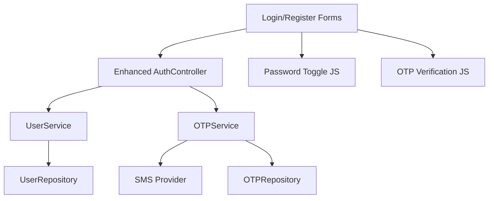

# Enhanced Authentication Design Document

## Overview

This design enhances the existing Spring Boot commerce platform authentication system by adding auto-fill support, SMS OTP verification, and password visibility toggles. The solution integrates with the current Thymeleaf-based frontend and Spring Security backend while adding new SMS integration capabilities.

## Architecture

The enhanced authentication system extends the existing architecture with these components:

- **Frontend Enhancements**: JavaScript modules for password toggle and OTP handling
- **SMS Service Integration**: New service layer for OTP generation and SMS delivery
- **Enhanced Controllers**: Extended AuthController with OTP verification endpoints
- **Database Extensions**: New tables for OTP storage and phone verification status



## Components and Interfaces

### Frontend Components

**Password Toggle Component**
- JavaScript module for show/hide password functionality
- CSS styling for eye icon states
- Event handlers for click interactions

**OTP Verification Component**
- Form fields for OTP input
- Timer display for OTP expiration
- Resend OTP functionality
- Real-time validation feedback

**Auto-fill Enhancement**
- HTML5 autocomplete attributes
- Proper form field naming conventions
- Browser compatibility considerations

### Backend Services

**OTPService Interface**
```java
public interface OTPService {
    String generateOTP(String phoneNumber);
    boolean validateOTP(String phoneNumber, String otp);
    void sendOTP(String phoneNumber, String otp);
    boolean isOTPExpired(String phoneNumber);
    void invalidateOTP(String phoneNumber);
}
```

**SMS Integration Service**
```java
public interface SMSService {
    void sendMessage(String phoneNumber, String message);
    boolean isValidPhoneNumber(String phoneNumber);
}
```

### Database Schema Extensions

**OTP Verification Table**
- id (Primary Key)
- phone_number (String, indexed)
- otp_code (String, encrypted)
- created_at (Timestamp)
- expires_at (Timestamp)
- attempts (Integer)
- verified (Boolean)

**User Table Extensions**
- phone_verified (Boolean, default false)
- phone_verification_date (Timestamp)

## Data Models

### OTP Entity
```java
@Entity
public class OTPVerification {
    @Id
    @GeneratedValue(strategy = GenerationType.IDENTITY)
    private Long id;
    
    @Column(nullable = false)
    private String phoneNumber;
    
    @Column(nullable = false)
    private String otpCode;
    
    @Column(nullable = false)
    private LocalDateTime createdAt;
    
    @Column(nullable = false)
    private LocalDateTime expiresAt;
    
    private int attempts = 0;
    private boolean verified = false;
}
```

### Enhanced User Model
```java
@Entity
public class User {
    // Existing fields...
    
    @Column(name = "phone_verified")
    private boolean phoneVerified = false;
    
    @Column(name = "phone_verification_date")
    private LocalDateTime phoneVerificationDate;
}
```

## Correctness Properties
*A property is a characteristic or behavior that should hold true across all valid executions of a system-essentially, a formal statement about what the system should do. Properties serve as the bridge between human-readable specifications and machine-verifiable correctness guarantees.*

**Property 1: Form validation consistency**
*For any* form submission with auto-filled or manually entered data, validation rules should be applied consistently regardless of input method
**Validates: Requirements 1.3**

**Property 2: Authentication flow independence**
*For any* valid credentials, the authentication process should succeed regardless of whether the credentials were auto-filled or manually entered
**Validates: Requirements 1.4**

**Property 3: Phone number validation**
*For any* phone number input, the validation should correctly identify valid and invalid phone number formats according to the specified format rules
**Validates: Requirements 2.1**

**Property 4: OTP delivery consistency**
*For any* valid phone number, when OTP verification is requested, the SMS service should be called with the correct phone number and generated OTP
**Validates: Requirements 2.2**

**Property 5: OTP verification success**
*For any* valid OTP entered within the time limit, the system should mark the associated phone number as verified and allow registration to proceed
**Validates: Requirements 2.4**

**Property 6: OTP verification failure handling**
*For any* invalid OTP entered, the system should display an error message and increment the attempt counter without marking the phone as verified
**Validates: Requirements 2.5**

**Property 7: OTP renewal after expiration**
*For any* expired OTP, the system should allow generation of a new OTP and reset the verification process
**Validates: Requirements 2.6**

**Property 8: Password visibility toggle behavior**
*For any* password field, clicking the visibility toggle should change the input type between "password" and "text" and update the icon state accordingly
**Validates: Requirements 3.2, 3.3**

**Property 9: Cursor position preservation**
*For any* password field with cursor position, toggling visibility should maintain the same cursor position within the input field
**Validates: Requirements 3.4**

**Property 10: Form submission independence from visibility**
*For any* form with password fields, submission should process the password value correctly regardless of whether the password is currently visible or hidden
**Validates: Requirements 3.5**

**Property 11: Required field validation**
*For any* registration form submission with missing required fields, the system should prevent submission and highlight all missing required fields
**Validates: Requirements 4.2**

**Property 12: Submit button state management**
*For any* registration form, the submit button should be enabled only when all required fields are completed and phone verification (if required) is successful
**Validates: Requirements 4.3, 4.4**

**Property 13: OTP rate limiting**
*For any* phone number, the system should enforce rate limits on OTP requests within a specified time period
**Validates: Requirements 5.1**

**Property 14: OTP expiration enforcement**
*For any* generated OTP, the system should mark it as expired after the specified time limit and reject verification attempts with expired OTPs
**Validates: Requirements 5.2**

**Property 15: Failed attempt blocking**
*For any* phone number with multiple failed OTP verification attempts, the system should temporarily block further verification attempts
**Validates: Requirements 5.3**

**Property 16: OTP invalidation after use**
*For any* successfully verified OTP, the system should invalidate it immediately to prevent reuse in subsequent verification attempts
**Validates: Requirements 5.4**

## Error Handling

### OTP-Related Errors
- **Invalid Phone Number**: Return clear error message with format requirements
- **Rate Limit Exceeded**: Return error with time until next attempt allowed
- **SMS Service Failure**: Graceful fallback with retry mechanism
- **Expired OTP**: Clear message with option to request new OTP
- **Invalid OTP**: Error message with remaining attempts counter

### Form Validation Errors
- **Missing Required Fields**: Highlight specific fields with descriptive messages
- **Password Mismatch**: Clear indication when password confirmation doesn't match
- **Auto-fill Validation**: Ensure auto-filled data is validated before submission

### Security Error Handling
- **Too Many Failed Attempts**: Temporary account lockout with clear unlock timeframe
- **Suspicious Activity**: Log security events and optionally notify administrators
- **Session Timeout**: Redirect to login with appropriate message

## Testing Strategy

### Unit Testing Approach
- Test individual service methods for OTP generation, validation, and expiration
- Test form validation logic with various input combinations
- Test SMS service integration with mock providers
- Test password toggle JavaScript functionality
- Test auto-fill attribute presence in rendered forms

### Property-Based Testing Approach
Using **jqwik** for Java property-based testing:

- **Phone Number Validation**: Generate various phone number formats and test validation consistency
- **OTP Generation and Validation**: Generate random OTPs and test the complete verification cycle
- **Rate Limiting**: Generate multiple requests and verify rate limiting enforcement
- **Form Validation**: Generate various form data combinations and test validation behavior
- **Password Toggle**: Generate different password values and test visibility toggle behavior

Each property-based test will run a minimum of 100 iterations to ensure comprehensive coverage. Tests will be tagged with comments referencing the specific correctness property from this design document using the format: **Feature: enhanced-authentication, Property {number}: {property_text}**

### Integration Testing
- End-to-end registration flow with OTP verification
- Login flow with auto-fill simulation
- SMS service integration testing with test phone numbers
- Browser compatibility testing for auto-fill and password toggle features

### Security Testing
- OTP brute force protection testing
- Rate limiting effectiveness testing
- Session management during OTP verification
- Password visibility toggle security implications