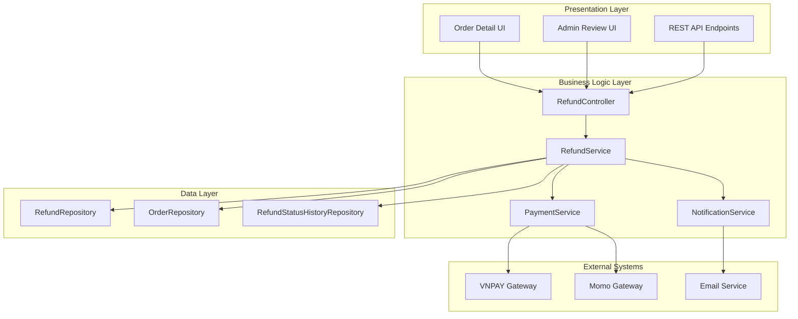

# Design Document: Refund & Complaint Handling System

## Overview

The Refund & Complaint Handling system is designed as a multi-layered architecture that integrates with existing e-commerce platform components. The system follows a service-oriented approach with clear separation between presentation, business logic, and data persistence layers.

The core workflow involves buyers initiating refund requests through a web interface, automatic processing for eligible small amounts, and manual admin review for larger amounts. The system maintains strict financial controls through validation, concurrency management, and comprehensive audit trails.

Key design principles:
- **Financial Integrity**: All refund amounts are validated against original payments
- **Concurrency Safety**: Row-level locking prevents race conditions
- **Audit Compliance**: Complete tracking of all refund activities
- **Gateway Integration**: Reliable communication with payment providers
- **Configuration Flexibility**: Business rules adjustable without code changes

## Architecture

The system follows a layered architecture pattern integrated with the existing Spring Boot e-commerce platform:



### Integration Points

- **Existing Order System**: Extends current order management with refund capabilities
- **Payment Gateway**: Leverages existing PaymentService for gateway communication
- **User Authentication**: Uses existing Spring Security authentication
- **Admin Dashboard**: Integrates with current admin interface
- **Notification System**: Extends existing notification infrastructure

## Components and Interfaces

### RefundController
**Responsibility**: Handle HTTP requests and coordinate refund operations

**Key Methods**:
```java
@PostMapping("/orders/{orderId}/refund")
ResponseEntity<RefundResponse> requestRefund(
    @PathVariable Long orderId,
    @RequestBody RefundRequest request,
    Authentication auth
)

@PostMapping("/admin/refunds/{refundId}/approve")
ResponseEntity<Void> approveRefund(
    @PathVariable Long refundId,
    Authentication auth
)

@PostMapping("/admin/refunds/{refundId}/reject")
ResponseEntity<Void> rejectRefund(
    @PathVariable Long refundId,
    @RequestBody RejectionReason reason,
    Authentication auth
)
```

### RefundService
**Responsibility**: Core business logic for refund processing

**Key Methods**:
```java
RefundResult requestPaymentRefund(Long orderId, Long userId, RefundRequest request)
void processAutomaticRefund(Refund refund)
void processManualApproval(Long refundId, Long adminId, boolean approved, String reason)
BigDecimal calculateRemainingRefundable(Long orderId)
```

### PaymentService (Extended)
**Responsibility**: Gateway communication and payment processing

**Key Methods**:
```java
GatewayRefundResponse executeRefund(String transactionId, BigDecimal amount, String reason)
PaymentTransaction getOriginalTransaction(Long orderId)
List<RefundTransaction> getPreviousRefunds(Long orderId)
```

### RefundRepository
**Responsibility**: Data persistence for refund entities

**Key Methods**:
```java
@Lock(LockModeType.PESSIMISTIC_WRITE)
@Query("SELECT o FROM Order o WHERE o.id = :orderId")
Optional<Order> findByIdForUpdate(@Param("orderId") Long orderId)

List<Refund> findByOrderIdOrderByCreatedAtDesc(Long orderId)
List<Refund> findByStatusAndCreatedAtBefore(RefundStatus status, LocalDateTime cutoff)
```

### NotificationService
**Responsibility**: Send notifications to users and admins

**Key Methods**:
```java
void notifyRefundRequested(Refund refund)
void notifyRefundCompleted(Refund refund)
void notifyAdminReviewRequired(Refund refund)
void notifyRefundRejected(Refund refund, String reason)
```

## Data Models

### Refund Entity
```java
@Entity
@Table(name = "refunds")
public class Refund {
    @Id
    @GeneratedValue(strategy = GenerationType.IDENTITY)
    private Long id;
    
    @Column(nullable = false)
    private Long orderId;
    
    @Column(nullable = false)
    private Long userId;
    
    @Column(nullable = false, precision = 10, scale = 2)
    private BigDecimal requestedAmount;
    
    @Column(precision = 10, scale = 2)
    private BigDecimal actualRefundAmount;
    
    @Column(nullable = false, length = 500)
    private String reason;
    
    @Enumerated(EnumType.STRING)
    @Column(nullable = false)
    private RefundStatus status;
    
    @Column(nullable = false)
    private LocalDateTime createdAt;
    
    private LocalDateTime processedAt;
    
    private Long processedBy;
    
    @Column(length = 1000)
    private String gatewayResponse;
    
    @Column(length = 100)
    private String gatewayTransactionId;
}
```

### RefundStatus Enum
```java
public enum RefundStatus {
    PENDING,           // Waiting for automatic processing
    PENDING_REVIEW,    // Waiting for admin approval
    APPROVED,          // Approved by admin, pending gateway processing
    COMPLETED,         // Successfully refunded
    REJECTED,          // Rejected by admin or system
    FAILED             // Gateway processing failed
}
```

### RefundStatusHistory Entity
```java
@Entity
@Table(name = "refund_status_history")
public class RefundStatusHistory {
    @Id
    @GeneratedValue(strategy = GenerationType.IDENTITY)
    private Long id;
    
    @Column(nullable = false)
    private Long refundId;
    
    @Enumerated(EnumType.STRING)
    @Column(nullable = false)
    private RefundStatus fromStatus;
    
    @Enumerated(EnumType.STRING)
    @Column(nullable = false)
    private RefundStatus toStatus;
    
    @Column(nullable = false)
    private LocalDateTime changedAt;
    
    private Long changedBy;
    
    @Column(length = 500)
    private String reason;
    
    @Column(length = 1000)
    private String additionalData;
}
```

### Order Entity Extensions
```java
// Add to existing Order entity
@Column(precision = 10, scale = 2, nullable = false)
private BigDecimal refundedAmount = BigDecimal.ZERO;

@Column(precision = 10, scale = 2)
private BigDecimal gatewayPaymentAmount;

@Enumerated(EnumType.STRING)
private PaymentType paymentType;
```

### Configuration Entity
```java
@Entity
@Table(name = "refund_configuration")
public class RefundConfiguration {
    @Id
    private String configKey;
    
    @Column(nullable = false)
    private String configValue;
    
    @Column(length = 500)
    private String description;
    
    @Column(nullable = false)
    private LocalDateTime updatedAt;
    
    private Long updatedBy;
}
```

### Request/Response DTOs
```java
public class RefundRequest {
    private BigDecimal requestedAmount;
    private String reason;
    // validation annotations
}

public class RefundResponse {
    private Long refundId;
    private RefundStatus status;
    private String message;
    private BigDecimal processedAmount;
}

public class RefundResult {
    private boolean success;
    private RefundStatus finalStatus;
    private String message;
    private BigDecimal actualAmount;
}
```

## Correctness Properties

*A property is a characteristic or behavior that should hold true across all valid executions of a system—essentially, a formal statement about what the system should do. Properties serve as the bridge between human-readable specifications and machine-verifiable correctness guarantees.*

### Property 1: Order Eligibility Validation
*For any* order and user combination, a refund request should only be allowed if the order has eligible status (DELIVERED, COMPLETED, or CANCELLED_WITH_PAYMENT), is within the refund period, uses gateway payment, and the requesting user owns the order
**Validates: Requirements 2.1, 2.2, 2.4, 3.1**

### Property 2: Refund Amount Constraints
*For any* refund request, the total of all refunds (including the new request) should never exceed the original gateway payment amount
**Validates: Requirements 2.3, 6.3**

### Property 3: UI Display Logic
*For any* order, the "Request refund" option should be displayed if and only if the order meets all eligibility criteria
**Validates: Requirements 1.1**

### Property 4: Refund Form Defaults
*For any* eligible order, the refund form should display correct order details and default the amount field to the remaining refundable amount
**Validates: Requirements 1.2**

### Property 5: Refund Entity Creation
*For any* valid refund request submission, a new Refund entity should be created with all required fields populated correctly
**Validates: Requirements 1.3**

### Property 6: Response Consistency
*For any* refund request submission, the system should return a valid response indicating either immediate processing completion or pending status
**Validates: Requirements 1.4**

### Property 7: Automatic Processing Workflow
*For any* refund request with amount below the auto-refund threshold, the system should automatically process it, call the Payment_Service, and update status to COMPLETED on success
**Validates: Requirements 4.1, 4.2, 4.3**

### Property 8: Automatic Processing Failure Handling
*For any* automatic refund that fails gateway processing, the system should set status to PENDING_REVIEW for manual handling
**Validates: Requirements 4.4**

### Property 9: Manual Review Routing
*For any* refund request with amount above the auto-refund threshold, the system should set status to PENDING_REVIEW and notify administrators
**Validates: Requirements 5.1, 5.2**

### Property 10: Admin Action Availability
*For any* refund in PENDING_REVIEW status, the system should allow admin users to perform APPROVE or REJECT actions
**Validates: Requirements 5.3**

### Property 11: Manual Approval Processing
*For any* admin-approved refund, the system should re-validate eligibility, process through Payment_Service, and update status to COMPLETED on success
**Validates: Requirements 5.4, 5.5**

### Property 12: Concurrency Control
*For any* refund processing operation, the system should use row-level locking when loading order data and execute all database changes within a single atomic transaction
**Validates: Requirements 6.1, 6.2**

### Property 13: Audit Trail Completeness
*For any* refund status change, gateway API call, or processing operation, the system should create appropriate audit log entries with timestamp, executor, and relevant details
**Validates: Requirements 7.1, 7.2, 7.3**

### Property 14: History Query Completeness
*For any* refund history query, the system should return complete chronological records of all status changes and operations
**Validates: Requirements 7.4**

### Property 15: Gateway Integration Success
*For any* successful gateway refund processing, the system should update refund status, Order aggregate, and store the actual refunded amount from gateway response
**Validates: Requirements 8.1, 8.2, 8.4**

### Property 16: Gateway Failure Handling
*For any* failed gateway refund call, the system should log the error and maintain appropriate status for retry
**Validates: Requirements 8.3**

### Property 17: Authentication and Authorization
*For any* refund system access, the system should verify user authentication, order ownership for buyers, and administrative privileges for admin functions, rejecting unauthorized requests with appropriate errors
**Validates: Requirements 9.1, 9.2, 9.3, 9.4**

### Property 18: Configuration Support
*For any* configuration parameter (auto-refund threshold, refund period), the system should support configurable values and use appropriate defaults when custom configuration is unavailable
**Validates: Requirements 10.1, 10.2, 10.4**

### Property 19: Refund Request Round Trip
*For any* valid refund request, creating the request and then querying it back should return equivalent data with all fields preserved
**Validates: Requirements 1.3, 7.3**

### Property 20: Payment Type Filtering
*For any* order with non-gateway payment types (vouchers, points), refund requests should be rejected with appropriate error messages
**Validates: Requirements 3.2, 3.3**

## Error Handling

### Validation Errors
- **Invalid Order Status**: Return HTTP 400 with message "Order is not eligible for refund"
- **Ownership Violation**: Return HTTP 403 with message "You can only request refunds for your own orders"
- **Amount Exceeds Limit**: Return HTTP 400 with message "Refund amount exceeds remaining refundable amount"
- **Time Window Expired**: Return HTTP 400 with message "Refund period has expired for this order"
- **Non-Gateway Payment**: Return HTTP 400 with message "Only gateway payments can be refunded"

### System Errors
- **Gateway Communication Failure**: Log error, set status to PENDING_REVIEW, notify admins
- **Database Transaction Failure**: Rollback all changes, return HTTP 500 with generic error message
- **Concurrency Conflict**: Retry operation up to 3 times, then fail with HTTP 409
- **Configuration Missing**: Use default values and log warning

### Error Recovery
- **Failed Automatic Refunds**: Automatically route to manual review queue
- **Gateway Timeout**: Mark as PENDING status for retry, implement exponential backoff
- **Partial Failures**: Maintain transaction integrity, log detailed error information
- **Audit Log Failures**: Continue operation but alert system administrators

## Testing Strategy

### Dual Testing Approach
The system requires both unit testing and property-based testing for comprehensive coverage:

**Unit Tests**: Focus on specific examples, edge cases, and error conditions
- Test specific refund scenarios with known inputs and expected outputs
- Verify error handling for invalid inputs
- Test integration points between components
- Validate specific business rules with concrete examples

**Property Tests**: Verify universal properties across all inputs
- Generate random orders, users, and refund requests to test eligibility rules
- Verify financial constraints hold across all possible input combinations
- Test concurrency scenarios with multiple simultaneous requests
- Validate audit trail completeness across all operations

### Property-Based Testing Configuration
- **Testing Library**: Use QuickCheck for Java or similar property-based testing framework
- **Minimum Iterations**: Each property test must run at least 100 iterations
- **Test Tagging**: Each property test must reference its design document property
- **Tag Format**: `// Feature: refund-complaint-handling, Property {number}: {property_text}`

### Test Data Generation
- **Order Generator**: Create orders with various statuses, payment types, and dates
- **User Generator**: Generate authenticated users with different roles and ownership relationships
- **Refund Request Generator**: Create requests with various amounts, reasons, and timing
- **Configuration Generator**: Test with different threshold and period configurations

### Integration Testing
- **Gateway Simulation**: Mock payment gateway responses for both success and failure scenarios
- **Database Testing**: Use test containers for database integration tests
- **Security Testing**: Verify authentication and authorization across all endpoints
- **Concurrency Testing**: Simulate multiple simultaneous refund requests

### Performance Considerations
- **Load Testing**: Verify system handles expected refund request volume
- **Database Performance**: Ensure queries perform well with large datasets
- **Gateway Timeout Handling**: Test resilience to slow gateway responses
- **Memory Usage**: Monitor memory consumption during bulk operations